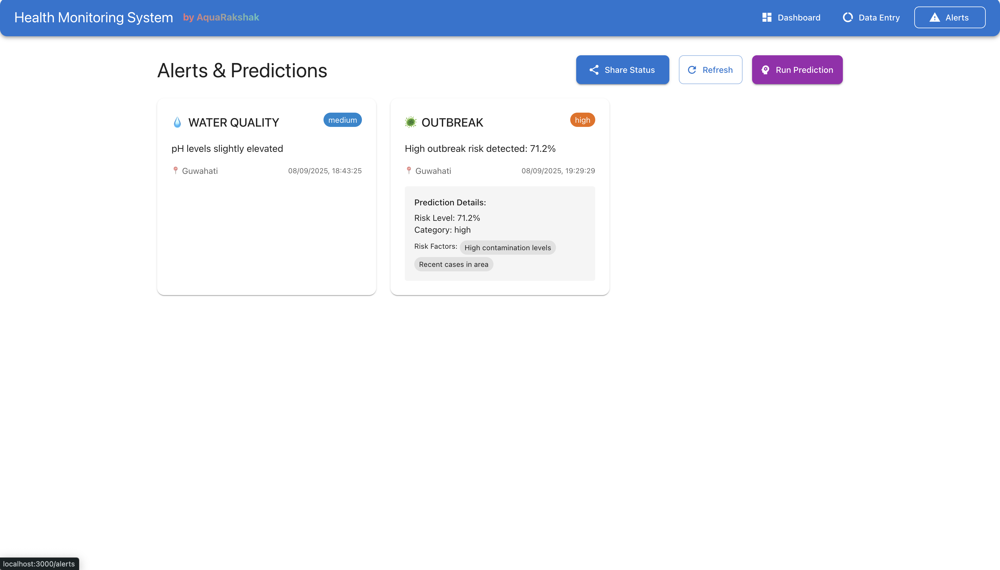
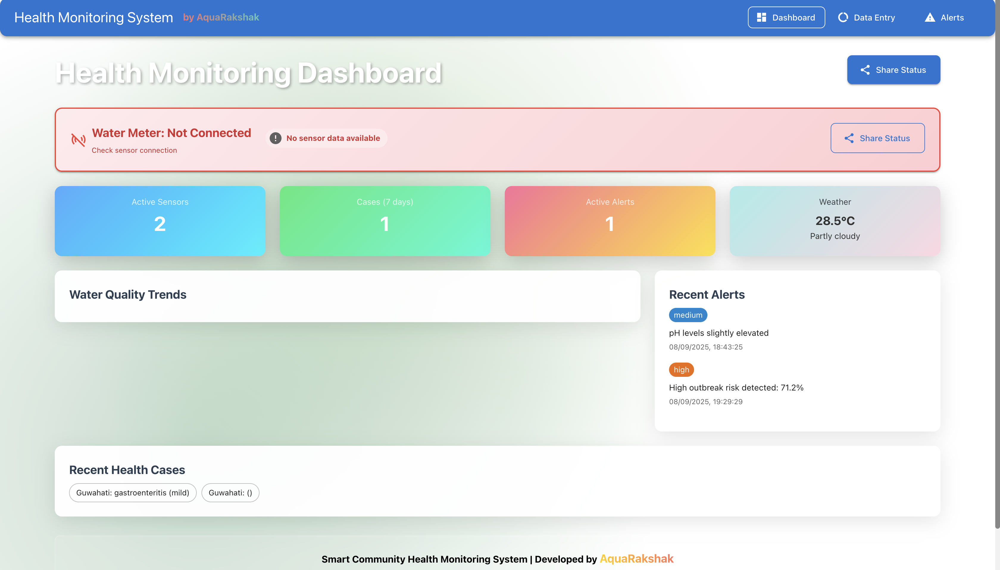
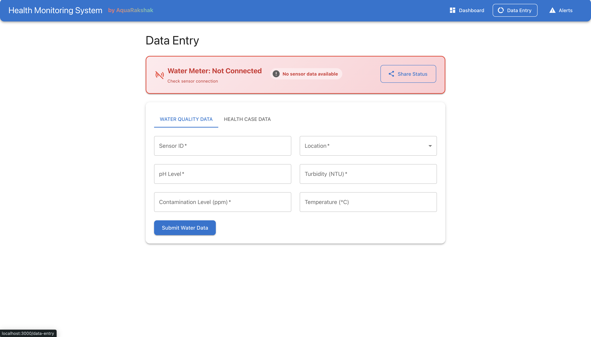
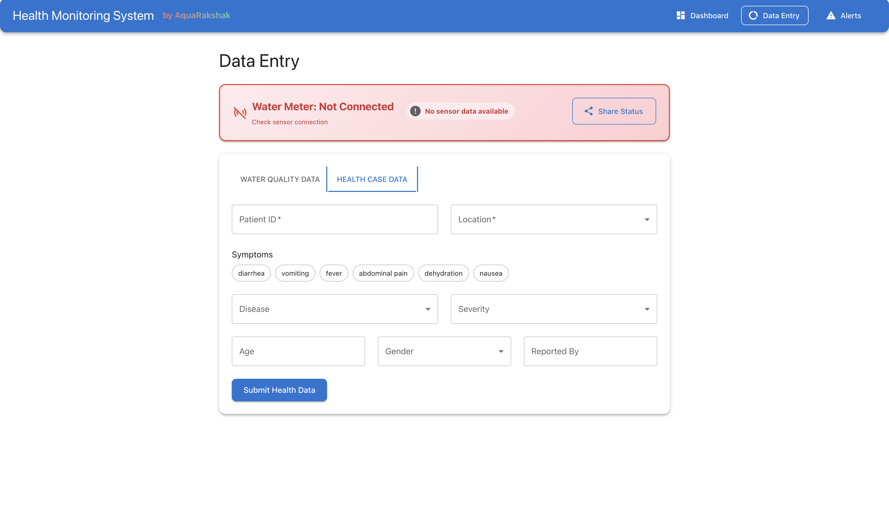

# **Smart Community Health Monitoring System**

# **Made by AquaRakshak**

**A comprehensive prototype system designed for monitoring water quality and predicting disease outbreaks in rural Northeast India. This intelligent health monitoring platform combines IoT sensor data, AI/ML predictions, and real-time alerts to help health workers prevent waterborne disease outbreaks in remote communities.**

## **About This Application**

**This system addresses critical health challenges in rural Northeast India by:**
- **Real-time Water Quality Monitoring**: **Tracks pH, turbidity, and contamination levels from IoT sensors**
- **Health Case Management**: **Records symptoms, diseases, and patient demographics**
- **AI-Powered Outbreak Prediction**: **Uses machine learning to predict disease outbreaks before they spread**
- **Early Warning System**: **Sends automated alerts to health workers and authorities**
- **Weather Integration**: **Correlates environmental conditions with disease risk factors**
- **Mobile-Responsive Dashboard**: **Accessible on any device for field health workers**

## **System Architecture**

- **Frontend**: **React dashboard for health workers**
- **Backend**: **Node.js/Express REST API**
- **Database**: **MongoDB for data storage**
- **ML Pipeline**: **Python scikit-learn for outbreak prediction**
- **Integrations**: **Weather API, SMS/Email alerts**

## **Quick Start**

### **Prerequisites**
- **Node.js 16+**
- **Python 3.8+**
- **MongoDB**
- **npm/yarn**

### **1. Backend Setup**
```bash
cd backend
npm install
npm run dev
```

### **2. Frontend Setup**
```bash
cd frontend
npm install
npm start
```

### **3. ML Pipeline Setup**
```bash
cd ml-pipeline
pip install -r requirements.txt
python app.py
```

### **4. Start Mock Data Generator**
```bash
cd backend
npm run mock-data
```

## **API Endpoints**

- **`POST /api/water-data`** - **Submit water quality data**
- **`POST /api/health-data`** - **Submit health case data**
- **`GET /api/alerts`** - **Get current alerts**
- **`GET /api/dashboard`** - **Get dashboard data**
- **`POST /api/predict`** - **Trigger ML prediction**

## **Environment Variables**

**Create `.env` files in backend and ml-pipeline directories:**

**Backend (.env)**:
```
MONGODB_URI=mongodb://localhost:27017/health-monitoring
PORT=5000
WEATHER_API_KEY=your_weather_api_key
```

**ML Pipeline (.env)**:
```
BACKEND_URL=http://localhost:5000
```

## **Features**

- **Real-time water quality monitoring**
- **Health case tracking**
- **AI-powered outbreak prediction**
- **Weather integration for risk assessment**
- **Alert system for health workers**
- **Mobile-responsive dashboard**






